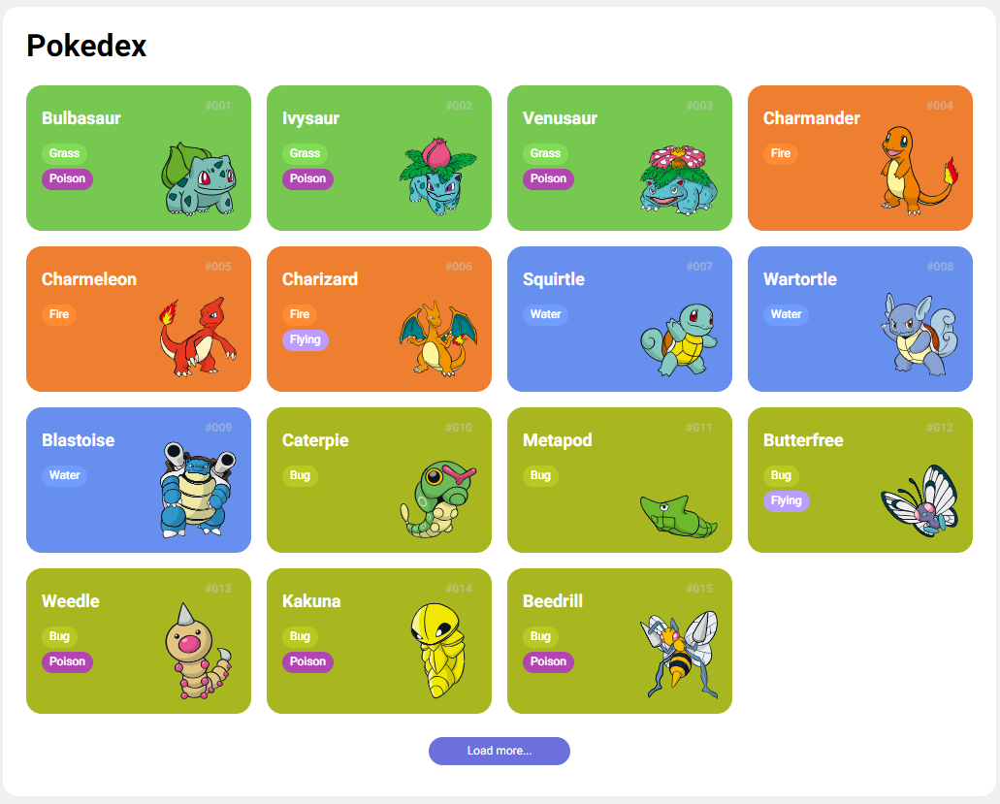

# Pokedex



Projeto Pokedex desenvolvido como parte do curso de Javascript da DIO.me. Neste projeto, exploramos o consumo de uma API REST do Pokemon V2 para exibir informações sobre diferentes pokémons. Além disso, aprendemos a utilizar os comandos básicos do GIT e o Github para controle de versão e colaboração.

## Funcionalidades

- Listagem de pokémons com imagens e nomes.
- Interface amigável e responsiva.

## Tecnologias Utilizadas

- HTML5
- CSS3
- JavaScript (ES6+)
- API REST Pokemon V2
- Git e Github

## Como Usar

1. Clone este repositório para o seu computador usando o comando abaixo:

```
git clone https://github.com/seu-usuario/pokedex.git
```

2. Navegue até o diretório do projeto:

```
cd pokedex
```

3. Abra o arquivo `index.html` em seu navegador.


